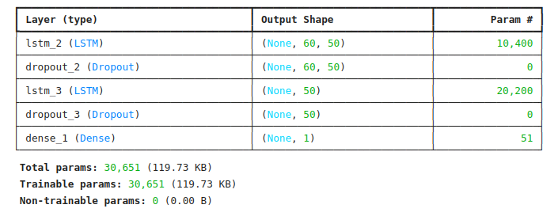
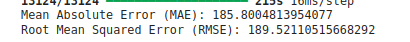
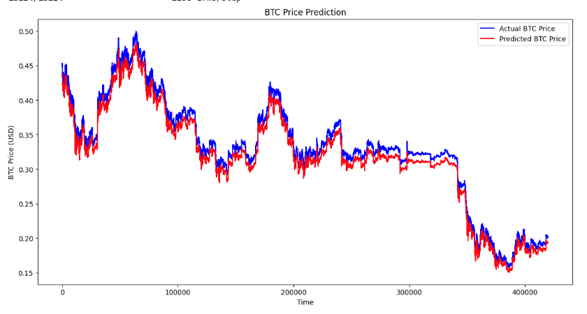

---

# Forecasting Bitcoin Prices with Time Series Analysis

## Introduction

Time series forecasting is a powerful tool in financial markets, enabling traders and analysts to make informed decisions based on historical data trends. Specifically, forecasting Bitcoin (BTC) prices can be valuable due to its volatile nature and the significant impact such forecasts can have on trading strategies. This project demonstrates how to forecast BTC prices using time series analysis with a Recurrent Neural Network (RNN) model.

---

## An Introduction to Time Series Forecasting

**Time Series Forecasting** involves predicting future values based on previously observed values. It is crucial in financial markets where historical price data can indicate future trends. By accurately forecasting BTC prices, investors can optimize their trading strategies and minimize risks.

The primary goal of this project is to leverage historical BTC price data to predict future prices, offering insights that could help in decision-making processes.

---

## Preprocessing Method

To prepare the data for training, we followed these preprocessing steps:

1. **Handling Missing Values**:
   - Missing values in the dataset were handled by forward filling to maintain the continuity of the time series data.
   - Code snippet:
     ```python
     coinbase_df.fillna(method='ffill', inplace=True)
     bitstamp_df.fillna(method='ffill', inplace=True)
     ```

2. **Normalization**:
   - The data was normalized to bring all the features to the same scale, which is essential for faster convergence of the model during training.
   - Code snippet:
     ```python
     from sklearn.preprocessing import MinMaxScaler
     scaler = MinMaxScaler(feature_range=(0, 1))
     scaled_data = scaler.fit_transform(bitstamp_df['Close'].values.reshape(-1, 1))
     ```

3. **Creating Time Series Data**:
   - The data was structured into sliding windows of input features and corresponding labels to train the model.
   - Code snippet:
     ```python
     X_train, y_train = [], []
     for i in range(60, len(scaled_data)):
         X_train.append(scaled_data[i-60:i, 0])
         y_train.append(scaled_data[i, 0])
     X_train, y_train = np.array(X_train), np.array(y_train)
     ```

---

## Setting Up tf.data.Dataset for Model Inputs

To efficiently handle and batch the time series data, TensorFlow's `tf.data.Dataset` was used:

1. **Batching**:
   - The dataset was batched to ensure the model processes data in chunks, which speeds up training and helps with memory management.
   - Code snippet:
     ```python
     dataset = tf.data.Dataset.from_tensor_slices((X_train, y_train))
     dataset = dataset.batch(32)
     ```

2. **Shuffling**:
   - Shuffling the dataset helps to prevent the model from learning the order of the data.
   - Code snippet:
     ```python
     dataset = dataset.shuffle(buffer_size=1000)
     ```

3. **Windowing**:
   - Windowing was applied to create smaller overlapping subsets of the data, allowing the model to focus on specific segments of the time series.
   - Code snippet:
     ```python
     dataset = dataset.window(size=60, shift=1, drop_remainder=True)
     ```

---

## Model Architecture

The chosen model architecture is a **Recurrent Neural Network (RNN)** using **LSTM** layers, which are well-suited for capturing patterns in sequential data:

1. **Model Design**:
   - The model consists of two LSTM layers followed by dropout layers to prevent overfitting, and a dense output layer.
   - Code snippet:
     ```python
     model = Sequential()
     model.add(LSTM(units=50, return_sequences=True, input_shape=(X_train.shape[1], 1)))
     model.add(Dropout(0.2))
     model.add(LSTM(units=50, return_sequences=False))
     model.add(Dropout(0.2))
     model.add(Dense(units=1))
     ```

2. **Why LSTM?**:
   - LSTM layers were chosen for their ability to capture long-term dependencies in time series data, which is crucial for accurate BTC price predictions.

3. **Model Summary**:
   - After constructing the model, a summary was generated to verify the architecture.
   - Code snippet:
     ```python
     model.summary()
     ```
---
     

## Results and Evaluation

The model's performance was evaluated using Mean Absolute Error (MAE) and Root Mean Squared Error (RMSE):

1. **MAE**:
   - MAE was used to measure the average magnitude of errors in the predictions.
   - Code snippet:
     ```python
     mae = mean_absolute_error(y_test, predicted_prices)
     print(f"Mean Absolute Error (MAE): {mae}")
     ```

2. **RMSE**:
   - RMSE provided a measure of the model's prediction error, giving more weight to larger errors.
   - Code snippet:
     ```python
     rmse = np.sqrt(mean_squared_error(y_test, predicted_prices))
     print(f"Root Mean Squared Error (RMSE): {rmse}")

     ```
     

3. **Graphical Representation**:
   - A plot was created to visualize the predicted vs. actual BTC prices.
   - Code snippet:
     ```python
     plt.figure(figsize=(10,6))
     plt.plot(actual_prices, color='black', label='Actual BTC Price')
     plt.plot(predicted_prices, color='green', label='Predicted BTC Price')
     plt.title('BTC Price Prediction')
     plt.xlabel('Time')
     plt.ylabel('BTC Price')
     plt.legend()
     plt.show()
     ```

   

---

## Conclusion

This project provided valuable insights into the complexities of time series forecasting, especially in the volatile context of Bitcoin prices. The LSTM-based model performed reasonably well, but there is always room for improvement, such as tuning the model further or experimenting with other architectures.

### Challenges
- Handling missing data and selecting appropriate features were significant challenges.
- The volatile nature of BTC prices made it difficult to achieve highly accurate predictions.

### Potential
- Forecasting BTC prices holds potential for aiding traders in making informed decisions and improving market strategies.

---

## Repository

The complete project, including all scripts and datasets, can be found in this GitHub repository: [BTC-Forecasting](https://github.com/johnobodai/BTC-Forecasting)

---

